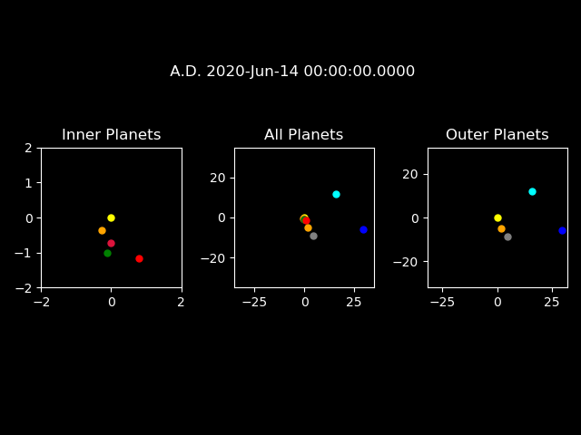

# PlanetPositions

This is a simple program that graphs the current positions of the planet in the Solar System.

The CSV data in the folder is good until July 4, 2024; after that time, the data must be updated from JPL's website (which should be available [here](https://ssd.jpl.nasa.gov/?horizons)).

As an example, when the program is run, it will output a graph that looks like the one below, but it will of course be updated for the current day (assuming your computer does have the correct date).

The size of the planets are of course not to scale, however, the positions marked are. As a result, the inner planets appear bunched together when the outer planets are within view. This is remedied by including three graphs, the right-most of which does not include the inner planets. In matplotlib there is a zoom function that makes having three graphs obsolete, but for a picture it is essential to get any idea of the relative positions (plus I think it's just more convenient to have all three).

The planets are of course relatively well aligned onto a plane, but since there are small variations, the CSV data does include a z-value which I did not make use of.
